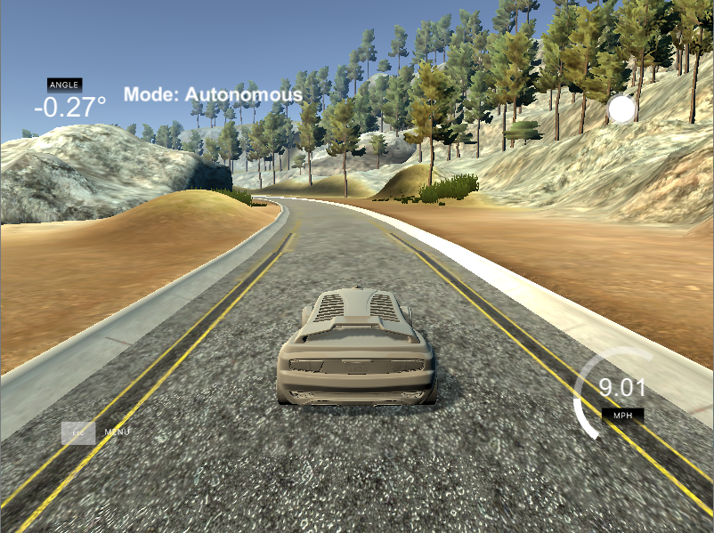

# **Behavioral Cloning** 

---
In this project for the Udacity Self-Driving Car Nanodegree a deep CNN is developed that can steer a car in a simulator provided by Udacity. The CNN drives the car autonomously around a track. The network is trained on images from a video stream that was recorded while a human was steering the car. The CNN thus clones the human driving behavior.


The goals / steps of this project are the following:
* Use the simulator to collect data of good driving behavior
* Build, a convolution neural network in Keras that predicts steering angles from images
* Train and validate the model with a training and validation set
* Test that the model successfully drives around track one without leaving the road
* Summarize the results with a written report


[//]: # (Image References)

[image1]: ./examples/placeholder.png "Model Visualization"
[image2]: ./examples/placeholder.png "Grayscaling"
[image3]: ./examples/placeholder_small.png "Recovery Image"
[image4]: ./examples/placeholder_small.png "Recovery Image"
[image5]: ./examples/placeholder_small.png "Recovery Image"
[image6]: ./examples/placeholder_small.png "Normal Image"
[image7]: ./examples/placeholder_small.png "Flipped Image"

 
### Getting started
---


#### 1. All required files  used to run the simulator in autonomous mode

The project includes the following files:
* **model.py** : containing the script to create and train the model
* **drive.py** : for driving the car in autonomous mode
* **model.h5** : containing a trained convolution neural network 
* **writeup_report.md** : Summarizing the results

#### 2. Submission includes functional code
Using the Udacity provided simulator and my drive.py file, the car can be driven autonomously around the track by executing 
```sh
python drive.py model.h5
```

#### 3. Submission code is usable and readable

The model.py file contains the code for training and saving the convolution neural network. The file shows the pipeline I used for training and validating the model, and it contains comments to explain how the code works.

### Model Architecture and Training Strategy

#### 1. An appropriate model architecture has been employed

My model consists of a convolution neural network with 5x5 and 3x3 filter sizes and depths between 24 and 64 (model.py lines 140-144) 

The model includes RELU layers to introduce nonlinearity (code line 20), and the data is normalized in the model using a Keras lambda layer (code line 140-144, 147, 149, 151 ). 

#### 2. Attempts to reduce overfitting in the model

The model contains dropout layers in order to reduce overfitting (model.py lines 146, 148, 150). 

The model was trained and validated on different data sets to ensure that the model was not overfitting (code line 138). The model was tested by running it through the simulator and ensuring that the vehicle could stay on the track.

#### 3. Model parameter tuning

The model used an adam optimizer, so the learning rate was not tuned manually (model.py line 159).

#### 4. Appropriate training data

Training data was chosen to keep the vehicle driving on the road. I used a combination of center lane driving, recovering from the left and right sides of the road ... 

For details about how I created the training data, see the next section. 

### Model Architecture and Training Strategy

#### 1. Solution Design Approach


My first step was to use a convolution neural network model similar to the PilotNet from NVIDIA's paper End to End Learning for Self-Driving Cars, because it solves basically the same problem.

In order to gauge how well the model was working, I split my image and steering angle data into a training and validation set. I found that my first model had a low mean squared error on the training set but a high mean squared error on the validation set. This implied that the model was overfitting. 

To combat the overfitting, I modified the model  by adding dropout layers before and between the bigger fully connected layers.

The final step was to run the simulator to see how well the car was driving around track one. There were a few spots where the vehicle fell off the track especially for two curves after the bridge.To improve the driving behavior in these cases, I added new samples covering the problematics spots.

At the end of the process, the vehicle is able to drive autonomously around the track without leaving the road.

#### 2. Final Model Architecture

The final model architecture (model.py lines 136-152) consisted of a convolution neural network with the following layers:

```

model = Sequential()
model.add(Cropping2D(cropping=((50, 20), (0, 0)), input_shape=(160, 320, 3)))
model.add(Lambda(lambda x: x/127.5 - 1.))
model.add(Convolution2D(24, (5, 5), strides=(2, 2), padding='valid', activation='relu'))
model.add(Convolution2D(36, (5, 5), strides=(2, 2), padding='valid', activation='relu'))
model.add(Convolution2D(48, (5, 5), strides=(2, 2), padding='valid', activation='relu'))
model.add(Convolution2D(64, (3, 3), strides=(1, 1), padding='valid', activation='relu'))
model.add(Convolution2D(64, (3, 3), strides=(1, 1), padding='valid', activation='relu'))
model.add(Flatten())
model.add(Dropout(0.5))
model.add(Dense(512, activation='relu'))
model.add(Dropout(0.5))
model.add(Dense(128, activation='relu'))
model.add(Dropout(0.5))
model.add(Dense(32, activation='relu'))
model.add(Dense(1))

```

Here is a visualization of the architecture 


Model Evaluation: 


#### 3. Creation of the Training Set & Training Process

The model was trained on:

Hardware: Processor: Intel i7 Graphics card: GeForce GTX 860m

To capture good driving behavior, I first recorded three laps on track1 and three laps on track2 using center lane driving. Here is an example image of center lane driving:


I then recorded the vehicle recovering from the left side and right sides of the road back to center so that the vehicle would learn to how to steer if it drifts off to the left or the right These images show what a recovery looks like starting from the situation when a car has one tire on the road edge and ending with a car properly set in the middle of the road.


Then I repeated this process on track two in order to get more data points.

To augment the data sat, I also flipped images and angles for helping with the left turn bias For example, here is an image that has then been flipped:


After the collection process, i then preprocessed this data by converting it to YUV.

I cropped 50 pixels from the top and 20 from the bottom of the images so that the model wasn't distracted by irrelevant information.
 

 

I finally randomly shuffled the data set and put 20% of the data into a validation set. 

I used this training data for training the model. The validation set helped determine if the model was over or under fitting. The ideal number of epochs was 5 the validation and training loss settle. I used an adam optimizer so that manually training the learning rate wasn't necessary.


## Results

After playing the model I was able to let the model run around the track with no issues at variable speed.

A video of the test track performance is shown here.


[](https://youtu.be/oSX4kePKhbs) 
