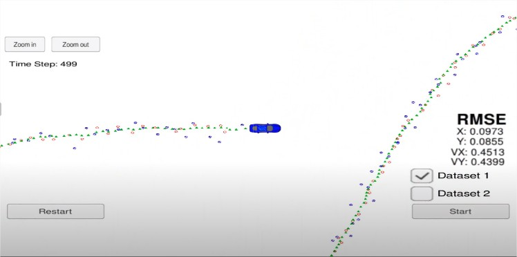

# Extended Kalman Filter Project
----
### Goal
---
The goal of this project is to build a tool that can accurately predict the location of a vehicle based on its lidar and radar sensor measurements. Given that different sensors will return different measurements, and that neither of these measurements may accurately reflect the true position of the car, we need to reconcile or "fuse" the various sensor inputs into one accurate prediction. To do this, we will build an Extended Kalman Filter.

There are three main steps for programming a Kalman filter:

* **initializing** Kalman filter variables
* **predicting** where our object is going to be after a time step \Delta{t}Δt
* **updating** where our object is based on sensor measurements

Then the prediction and update steps repeat themselves in a loop.

To measure how well our Kalman filter performs, we will then calculate root mean squared error comparing the Kalman filter results with the provided ground truth.

These three steps (initialize, predict, update) plus calculating RMSE encapsulate the entire extended Kalman filter project.


### Files in the Github src Folder
The files you need to work with are in the `src` folder of the github repository.

```
.
├── FusionEKF.cpp
├── FusionEKF.h
├── json.hpp
├── kalman_filter.cpp
├── kalman_filter.h
├── main.cpp
├── measurement_package.h
├── tools.cpp
└── tools.h
```

* **`main.cpp`** - communicates with the Term 2 Simulator receiving data measurements, calls a function to run the Kalman filter, calls a function to calculate RMSE
* **`FusionEKF.cpp`** - initializes the filter, calls the predict function, calls the update function
* **`kalman_filter.cpp`** - defines the predict function, the update function for lidar, and the update function for radar
* **`tools.cpp`** - function to calculate RMSE and the Jacobian matrix.

### How the Files Relate to Each Other
Here is a brief overview of what happens when you run the code files:

* `Main.cpp` reads in the data and sends a sensor measurement to `FusionEKF.cpp`
* `FusionEKF.cpp` takes the sensor data and initializes variables and updates variables. The Kalman filter equations are not in this file. `FusionEKF.cpp` has a variable called `ekf_`, which is an instance of a KalmanFilter class. The `ekf_` will hold the matrix and vector values. You will also use the `ekf_` instance to call the predict and update equations.
* The KalmanFilter class is defined in `kalman_filter.cpp` and `kalman_filter.h`.

# Results
---

The simulator provides noisy lidar and radar measurements which are shown as blue and red dots. The position that is calculated by the kalman filter is displayed as green dots.

The results for dataset 1 are shown in the following image

[](https://youtu.be/leP2tdMDdeQ) 


In case you want to run this project yourself, here is the project starter code.

# Project Starter Code
-----


In this project you will utilize a kalman filter to estimate the state of a moving object of interest with noisy lidar and radar measurements. Passing the project requires obtaining RMSE values that are lower than the tolerance outlined in the project rubric. 

This project involves the Term 2 Simulator which can be downloaded [here](https://github.com/udacity/self-driving-car-sim/releases).

This repository includes two files that can be used to set up and install [uWebSocketIO](https://github.com/uWebSockets/uWebSockets) for either Linux or Mac systems. For windows you can use either Docker, VMware, or even [Windows 10 Bash on Ubuntu](https://www.howtogeek.com/249966/how-to-install-and-use-the-linux-bash-shell-on-windows-10/) to install uWebSocketIO. Please see the uWebSocketIO Starter Guide page in the classroom within the EKF Project lesson for the required version and installation scripts.

Once the install for uWebSocketIO is complete, the main program can be built and run by doing the following from the project top directory.

1. mkdir build
2. cd build
3. cmake ..
4. make
5. ./ExtendedKF

Tips for setting up your environment can be found in the classroom lesson for this project.

Note that the programs that need to be written to accomplish the project are src/FusionEKF.cpp, src/FusionEKF.h, kalman_filter.cpp, kalman_filter.h, tools.cpp, and tools.h

The program main.cpp has already been filled out, but feel free to modify it.

Here is the main protocol that main.cpp uses for uWebSocketIO in communicating with the simulator.


**INPUT**: values provided by the simulator to the c++ program

["sensor_measurement"] => the measurement that the simulator observed (either lidar or radar)


**OUTPUT**: values provided by the c++ program to the simulator

["estimate_x"] <= kalman filter estimated position x

["estimate_y"] <= kalman filter estimated position y

["rmse_x"]

["rmse_y"]

["rmse_vx"]

["rmse_vy"]

---

## Other Important Dependencies

* cmake >= 3.5
  * All OSes: [click here for installation instructions](https://cmake.org/install/)
* make >= 4.1 (Linux, Mac), 3.81 (Windows)
  * Linux: make is installed by default on most Linux distros
  * Mac: [install Xcode command line tools to get make](https://developer.apple.com/xcode/features/)
  * Windows: [Click here for installation instructions](http://gnuwin32.sourceforge.net/packages/make.htm)
* gcc/g++ >= 5.4
  * Linux: gcc / g++ is installed by default on most Linux distros
  * Mac: same deal as make - [install Xcode command line tools](https://developer.apple.com/xcode/features/)
  * Windows: recommend using [MinGW](http://www.mingw.org/)

## Basic Build Instructions

1. Clone this repo.
2. Make a build directory: `mkdir build && cd build`
3. Compile: `cmake .. && make` 
   * On windows, you may need to run: `cmake .. -G "Unix Makefiles" && make`
4. Run it: `./ExtendedKF `

## Editor Settings

We've purposefully kept editor configuration files out of this repo in order to
keep it as simple and environment agnostic as possible. However, we recommend
using the following settings:

* indent using spaces
* set tab width to 2 spaces (keeps the matrices in source code aligned)

## Code Style

Please (do your best to) stick to [Google's C++ style guide](https://google.github.io/styleguide/cppguide.html).

## Generating Additional Data

This is optional!

If you'd like to generate your own radar and lidar data, see the
[utilities repo](https://github.com/udacity/CarND-Mercedes-SF-Utilities) for
Matlab scripts that can generate additional data.

## Project Instructions and Rubric

Note: regardless of the changes you make, your project must be buildable using
cmake and make!

More information is only accessible by people who are already enrolled in Term 2 (three-term version) or Term 1 (two-term version)
of CarND. If you are enrolled, see the Project Resources page in the classroom
for instructions and the project rubric.


